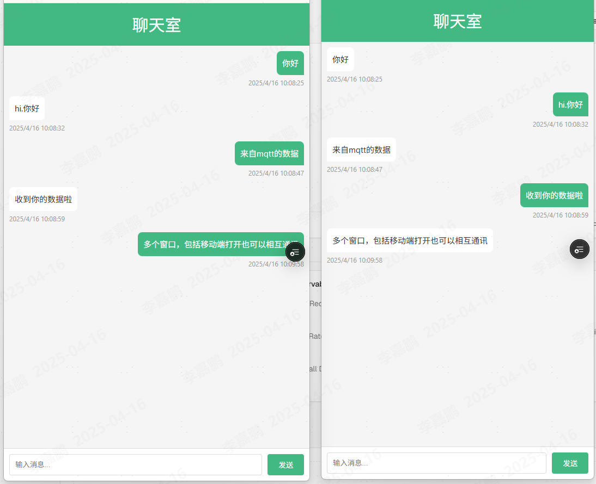

# mqttA

vue3 mqtt.js实现聊天demo
当前[mqttA](https://github.com/time202051/mqttA)实现的聊天demo，启动多个窗口之间的实时交互，基于vue3+mqtt.js实现，使用mqtt.js实现了mqtt协议的连接，订阅，发布，接收消息等功能。



智能小车
上下左右键 （本插件意在发送数据给esp，esp接收到数据后自行处理）具体指令可在日志打印的内容中看到。且支持输入框发送自定义指令

## Recommended IDE Setup

[VSCode](https://code.visualstudio.com/) + [Volar](https://marketplace.visualstudio.com/items?itemName=Vue.volar) (and disable Vetur).

## Type Support for `.vue` Imports in TS

TypeScript cannot handle type information for `.vue` imports by default, so we replace the `tsc` CLI with `vue-tsc` for type checking. In editors, we need [Volar](https://marketplace.visualstudio.com/items?itemName=Vue.volar) to make the TypeScript language service aware of `.vue` types.

## Customize configuration

See [Vite Configuration Reference](https://vite.dev/config/).

## Project Setup

```sh
npm install
```

### Compile and Hot-Reload for Development

```sh
npm run dev
```

### Type-Check, Compile and Minify for Production

```sh
npm run build
```

### Lint with [ESLint](https://eslint.org/)

```sh
npm run lint
```
